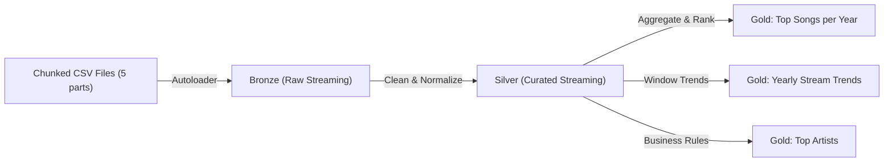
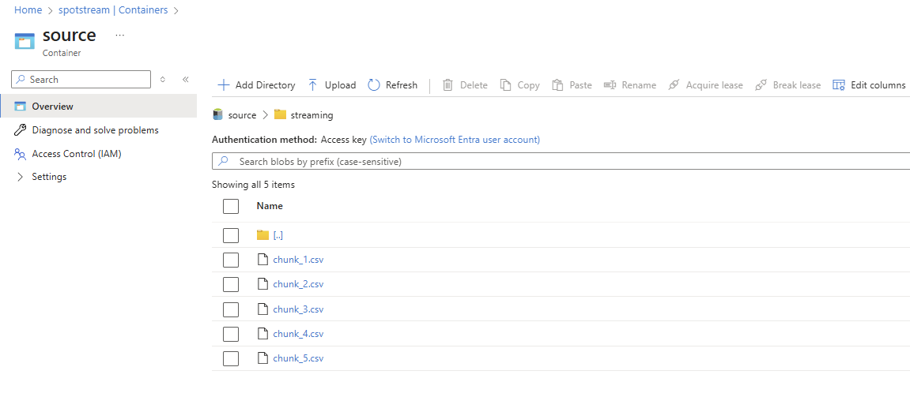
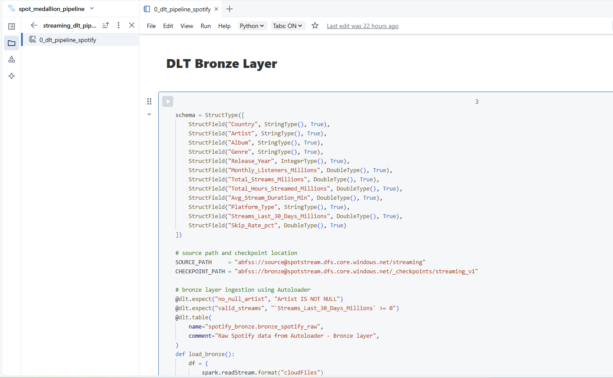
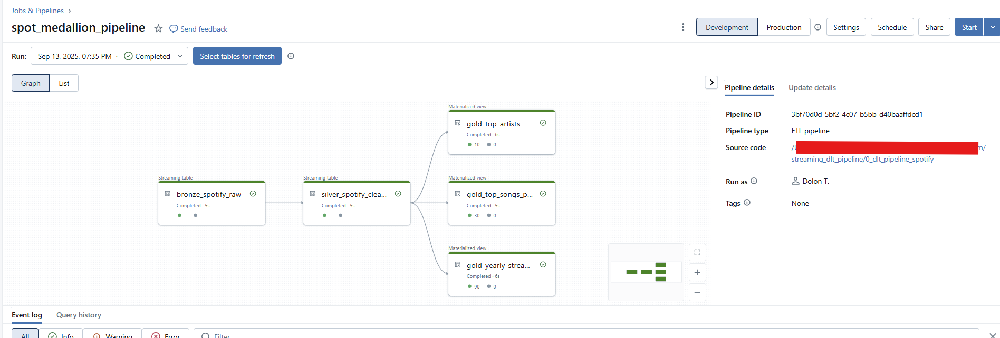
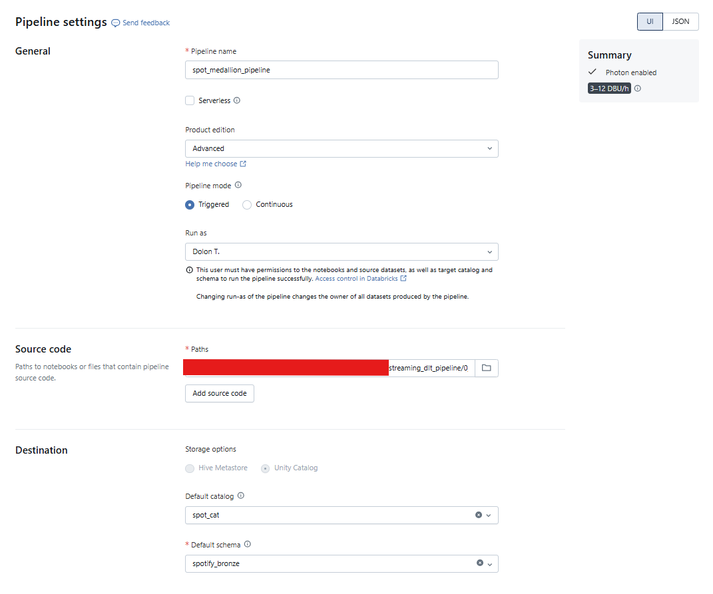
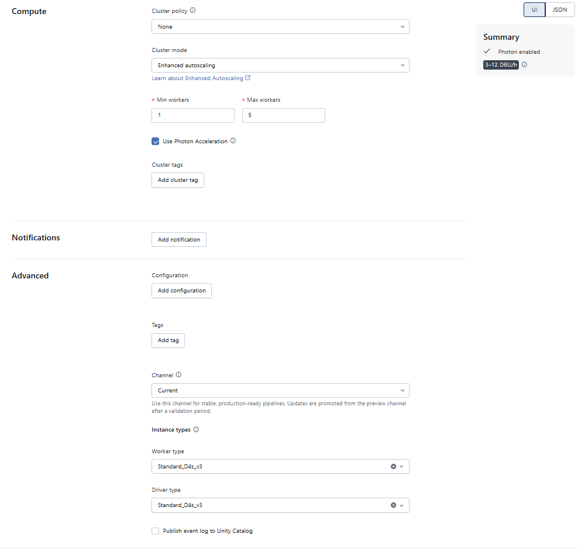
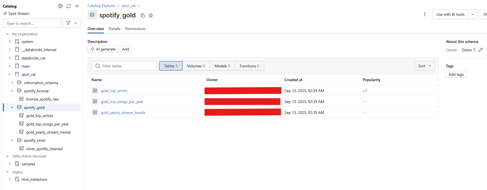
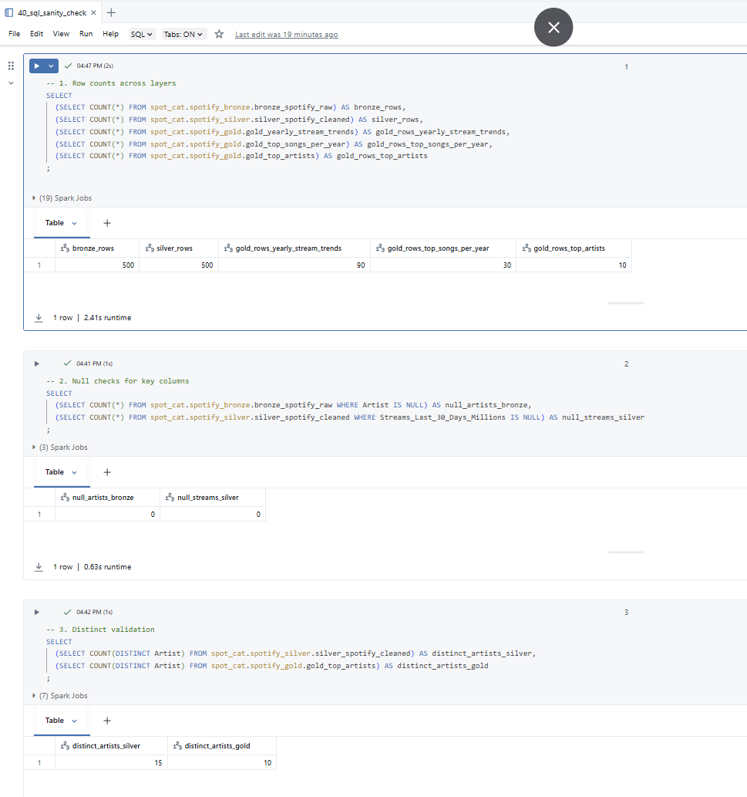

# Spotify Streaming Data Pipeline (Azure Databricks, Medallion: Bronze → Silver → Gold)

[](LICENSE)


Production-grade **streaming pipeline** built on **Azure Databricks (Unity Catalog)** using **Autoloader**, **Delta Live Tables (DLT)**, and **PySpark**.  
This project demonstrates:  
- Schema-qualified routing (`spotify_bronze`, `spotify_silver`, `spotify_gold`)  
- Modular transformations for streaming ETL  
- Real-time ingestion from **chunked CSVs** simulating event streams  

---

## Table of Contents
- [Architecture](#architecture)
- [Project Layout](#project-layout)
- [Streaming Strategy](#streaming-strategy)
- [How to Run](#how-to-run)
- [Configuration](#configuration)
- [Validation & Quality Checks](#validation--quality-checks)
- [Screenshots](#screenshots)
- [Pain Points & Decisions](#pain-points--decisions)
- [Cost & Cluster Notes](#cost--cluster-notes)
- [License](#license)
---
## Architecture


---

## Project Layout

```
spotify-streaming-pipeline/
│
├─ config/
│   └─ 00_config.py
├─ bronze/
│   └─ 10_bronze_autoload.py
├─ silver/
│   └─ 20_silver_transformation.py
├─ gold/
│   └─ 30_gold_models.py
├─ sanity_checks/
│   └─ 40_sql_sanity_check.sql
│
├─ docs/
│   ├─ img/
│   │   ├─ 01_source_data.png
│   │   ├─ 02_dlt_code_snippet.png
│   │   ├─ 03_job_run_dag.png
│   │   ├─ 04a_pipeline_settings.png
│   │   ├─ 04b_pipeline_settings.png
│   │   ├─ 05_catalog_spotify_gold.png
│   │   └─ 06_sql_sanity_checks.png
│   ├─ pain_points.md
│   └─ decisions.md
│
├─ README.md
└─ LICENSE


```

---

## Streaming Strategy

To simulate real-time ingestion, the raw Spotify dataset was split into five CSV chunks and uploaded to the `source/streaming/` container. These files were released sequentially, mimicking the arrival of new data in a production environment.

The pipeline uses Databricks Autoloader to detect and ingest new files as they land, streaming them directly into the Bronze layer. This approach transforms a static dataset into a dynamic ingestion flow—bridging the gap between batch loading and true streaming architecture.

By combining Autoloader with schema-qualified routing and checkpointing, the project demonstrates a scalable, production-like streaming strategy suitable for real-world deployment.


---

## How to Run

### 1. Prepare Unity Catalog
```sql
CREATE CATALOG IF NOT EXISTS <your_catalog>;
CREATE SCHEMA  IF NOT EXISTS <your_catalog>.spotify_bronze;
CREATE SCHEMA  IF NOT EXISTS <your_catalog>.spotify_silver;
CREATE SCHEMA  IF NOT EXISTS <your_catalog>.spotify_gold;
```
### 2. Upload Data
- Split raw dataset into 5 parts: `chunk_1.csv` … `chunk_5.csv`
- Place files into:
    `abfss://source@<storage_account>.dfs.core.windows.net/streaming/`

### 3. Configure DLT Pipeline
- **Source notebook**: `0_dlt_pipeline_spotify`
- **Target Catalog**: `<your_catalog>`
- **Target Schemas**: `spotify_bronze`, `spotify_silver`, `spotify_gold`
- **Compute**: Small job cluster (1–5 workers) with **Photon ON**
- **Mode**: Triggered (processes available files once per run)

### 4. Run Pipeline
- Each new chunk ingested → flows through **Bronze** → **Silver** → **Gold** layers automatically

### 5. Validate
- Run the `40_sql_sanity_check.sql` notebook to confirm:
- Row counts across layers
- Null checks on key columns
- Distinct validation

--- 

## Configuration

| Setting             | Where                 | Notes                                                                    |
| ------------------- | --------------------- | ------------------------------------------------------------------------ |
| `SOURCE_PATH`       | DLT notebook          | `abfss://source@<storage_account>.dfs.core.windows.net/streaming`        |
| `CHECKPOINT_PATH`   | DLT notebook          | `abfss://bronze@<storage_account>.dfs.core.windows.net/_checkpoints`     |
| Cluster             | Databricks UI         | Job cluster, **Photon ON**, 1–5 workers                                  |
| UC Schemas          | SQL init step         | `spotify_bronze`, `spotify_silver`, `spotify_gold`                       |


## Validation & Quality Checks

**Row counts across layers**  
```sql
SELECT
  (SELECT COUNT(*) FROM <catalog>.<bronze_schema>.<bronze_table>) AS bronze_rows,
  (SELECT COUNT(*) FROM <catalog>.<silver_schema>.<silver_table>) AS silver_rows,
  (SELECT COUNT(*) FROM <catalog>.<gold_schema>.<gold_table_trends>) AS gold_rows_yearly_stream_trends,
  (SELECT COUNT(*) FROM <catalog>.<gold_schema>.<gold_table_songs>) AS gold_rows_top_songs_per_year,
  (SELECT COUNT(*) FROM <catalog>.<gold_schema>.<gold_table_artists>) AS gold_rows_top_artists
;
```

**Null checks for key columns**  
```sql
SELECT
  (SELECT COUNT(*) 
     FROM <catalog>.<bronze_schema>.<bronze_table> 
    WHERE <artist_column> IS NULL) AS null_artists_bronze,

  (SELECT COUNT(*) 
     FROM <catalog>.<silver_schema>.<silver_table> 
    WHERE <streams_column> IS NULL) AS null_streams_silver
;
```

**Distinct validation**  
```sql
SELECT
  (SELECT COUNT(DISTINCT <artist_column>) 
     FROM <catalog>.<silver_schema>.<silver_table>) AS distinct_artists_silver,

  (SELECT COUNT(DISTINCT <artist_column>) 
     FROM <catalog>.<gold_schema>.<gold_table_artists>) AS distinct_artists_gold
;
```
---
## Screenshots

### Source Data Upload
Manually split the original CSV into chunks and uploaded them to the `/streaming` folder to simulate real-time ingestion into the Bronze layer using Autoloader.




### DLT Code Snippet
Bronze, Silver, and Gold transformations defined in a Delta Live Tables pipeline, with Unity Catalog routing and schema-aware expectations.




### Job Run DAG
Execution DAG showing a successful flow from Bronze → Silver → Gold using job cluster orchestration in Databricks.




### DLT Pipeline Settings (04a)
DLT pipeline configured in continuous mode with Photon compute enabled and event-based triggering.




### DLT Pipeline Settings (04b)



### Catalog: `spotify_gold`
Final analytics-ready Delta tables written to the `spotify_gold` schema, governed and managed via Unity Catalog.




### SQL sanity (counts & FK nulls) 
Post-pipeline validation notebook: row count checks, null analysis, and distinct key scans across Bronze, Silver, and Gold layers.




---
7
## Pain Points & Decisions
- See [doc/pain_points_and_decisions.md](doc/pain_points_and_decisions.md)


---

## Cost & Cluster Notes

- For development-scale pipelines, a small job cluster (1–2 workers) is sufficient
- Photon enabled for performance improvements on Delta and SQL workloads
- Costs are tied to cluster uptime — shut down clusters when idle to avoid waste
- Always check Azure vCPU quotas per region to avoid `WAITING_FOR_RESOURCES` errors
- To reduce cost, used a custom VNet setup instead of a NAT Gateway

---

## License  
- Released under the MIT License
