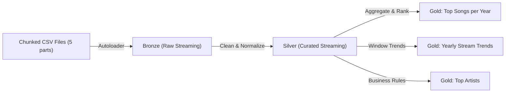

# Spotify Streaming Data Pipeline (Azure Databricks, Medallion: Bronze → Silver → Gold)

Production-grade **streaming pipeline** built on **Azure Databricks (Unity Catalog)** using **Autoloader**, **Delta Live Tables (DLT)**, and **PySpark**.  
This project demonstrates:  
- Schema-qualified routing (`spotify_bronze`, `spotify_silver`, `spotify_gold`)  
- Modular transformations for streaming ETL  
- Real-time ingestion from **chunked CSVs** simulating event streams  

---

---
